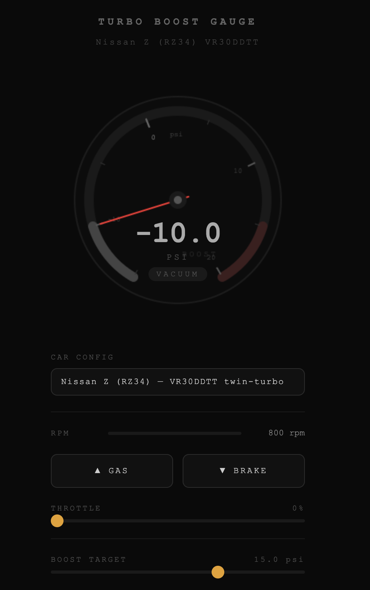

# Better Games Library

I was playing Forza and noticed the turbo gauge was completely wrong. Boost builds instantly, drops instantly, and doesn't care what RPM you're at or how hard you're on the throttle.

So I started researching. Read STILLEN's VR30DDTT analysis, dug through EcuTek boost control docs, drove my actual Nissan Z and compared the data. Built a simulation that actually matches what the car does. Then I thought: why should every game developer have to do all this from scratch?

This library is a  collection of **game mechanic specs** that any developer can pick up and implement, whether you're building an indie game in Godot, a web game in JavaScript, or working on the next Forza. Each spec covers the hard stuff: the physics research, the edge cases, the data contracts, the test cases. You read the spec and implement it in whatever engine or language you're using. No lock-in, no dependencies, no reinventing the wheel.

The turbo boost gauge is just the first one. The goal is a full library covering everything from inventory systems to vehicle physics.

---

## Live demo

The turbo boost gauge spec ships with an interactive demo. Try it here: **[better-games demo](https://daltlc.github.io/better-games)**

It simulates a real Nissan Z (RZ34) VR30DDTT boost gauge with physics validated against an actual car. You can switch car configs in the dropdown and feel the difference between the twin-turbo Z and a single-turbo WRX STI.



---

## Catalog

| Spec | Category | Status |
|---|---|---|
| [`inventory`](specs/core-systems/inventory.bgl.md) | core-systems | stable |
| [`crafting`](specs/progression/crafting.bgl.md) | progression | stable |
| [`save-system`](specs/core-systems/save-system.bgl.md) | core-systems | stable |
| [`turbo-boost-gauge`](specs/vehicle-systems/turbo-boost-gauge.bgl.md) | vehicle-systems | draft |

Machine-readable version: [`registry.json`](registry.json)

Roadmap: `equipment`, `loot`, `shop`, `quests`, `dialogue`, `health-combat`, `vehicle-engine`. See [`ROADMAP.md`](ROADMAP.md).

---

## How to use a spec

### As a developer

1. Find the spec you want in the catalog above.
2. Read **Overview, Data Contracts, and Core Operations** like a design doc.
3. Implement it in your engine. Use the **Test Cases** section as your checklist.
4. If the spec has a `dependsOn` list, implement those first.

### With an AI agent

Paste the spec into your prompt and tell the agent what engine you're using:

> Implement the feature in `specs/vehicle-systems/turbo-boost-gauge.bgl.md` for my project. It uses **[your engine / language]**. Follow the Agent Instructions section. Generate unit tests from the Test Cases section.

More prompt patterns in [`examples/USAGE.md`](examples/USAGE.md). The interactive demo lives at [`docs/index.html`](docs/index.html).

---

## Car configs (vehicle-systems specs)

Vehicle specs separate the simulation logic from the car data. Each car has its own `.ini` file in `data/cars/` with the physics constants for that platform. Same format as Assetto Corsa and rFactor, so if you know how to mod those games this will feel familiar.

```
data/cars/nissan-z-vr30ddtt.ini       # Garrett twin-turbo, electronic wastegates, no BOV
data/cars/subaru-wrx-sti-ej257.ini    # Mitsubishi single-turbo, pneumatic WG, atmospheric BOV
```

To add a new car, drop a new `.ini` in `data/cars/` following the same section structure. The comments in the existing files explain what each constant does and where it came from.

---

## Tooling

```sh
cd tools
npm test          # run unit + integration tests
npm run validate  # lint every spec
npm run build     # regenerate registry.json
```

Zero runtime dependencies. No `npm install` needed.

---

## Repo layout

```
specs/           # feature specs grouped by category
data/cars/       # per-car INI configs for vehicle-systems specs
docs/            # GitHub Pages (index.html is the live demo)
examples/        # prompt patterns for AI agents
tools/           # validator, registry builder, tests
SPEC-FORMAT.md   # the meta-spec every .bgl.md conforms to
TEMPLATE.bgl.md  # copy this to start a new spec
registry.json    # generated catalog, do not hand-edit
```

---

## Contributing

See [`CONTRIBUTING.md`](CONTRIBUTING.md) and [`AGENTS.md`](AGENTS.md) for standards.

MIT License. See [`LICENSE`](LICENSE).
